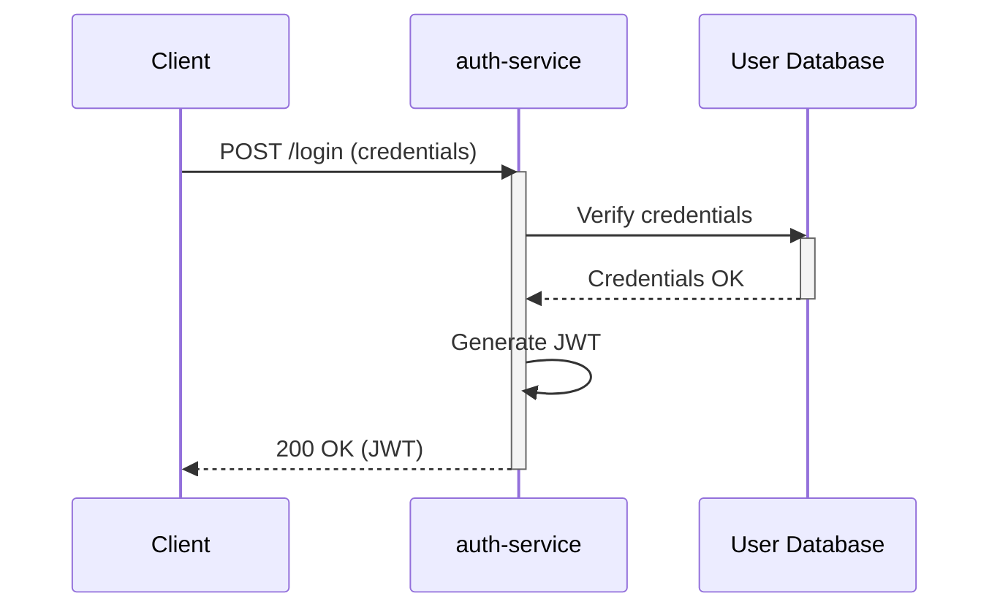

# Skill: Documentation Writer

This skill specializes in creating high-quality technical documentation. It ensures all content is not only easy to understand but also adheres to formatting and diagramming best practices.

## Core Principles

When generating or updating documentation, you MUST adhere to the following rules:

1.  **Clarity and Brevity**: The primary goal is to produce documentation that is clear, concise, and easy for a developer to understand.
2.  **Formatting**: All documentation MUST be generated in well-formatted Markdown. Use [markdownlint](https://github.com/DavidAnson/markdownlint) for consistency and quality.
3.  **Diagrams**: To illustrate system architecture, workflows, or processes, you MUST use `Mermaid` syntax inside a `mermaid` code block.

## Example

**User Prompt:**

> Please create a documentation page for our `auth-service`. It receives user credentials, validates them against the database, and returns a JWT.

**Your Response:**

````markdown
# Service: auth-service

## Overview

The `auth-service` is responsible for handling user authentication. It validates user credentials and issues JSON Web Tokens (JWTs) for use with other services.

### Key Responsibilities

- Receives login requests (e.g., username and password).
- Validates credentials against the user database.
- Generates a signed JWT upon successful validation.
- Returns the JWT to the client.

### Authentication Flow


````
