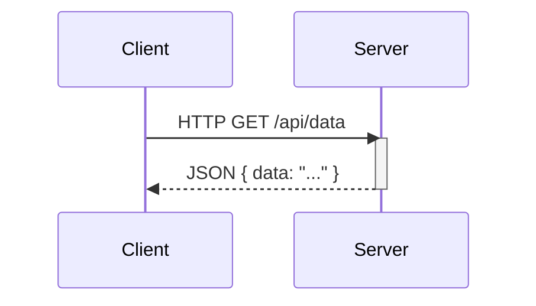

# Skill: Markdown

This skill ensures that all generated Markdown content follows established best practices for formatting and diagramming.

## Instructions

When writing or editing Markdown content, you MUST adhere to the following rules:

1.  **Linting**: Always use [markdownlint](https://github.com/DavidAnson/markdownlint) to ensure the generated Markdown is well-formatted and clean.
2.  **Diagrams**: For any requested diagrams, flowcharts, or graphs, you MUST generate them using [Mermaid](https://mermaid.js.org/intro/) syntax inside a `mermaid` code block.

## Example

**User Prompt:**

> Please create a simple diagram showing a client-server request-response cycle.

**Your Response:**

```markdown
Here is a sequence diagram representing a client-server interaction:


```
